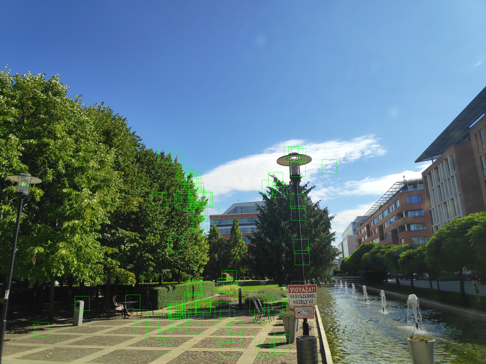
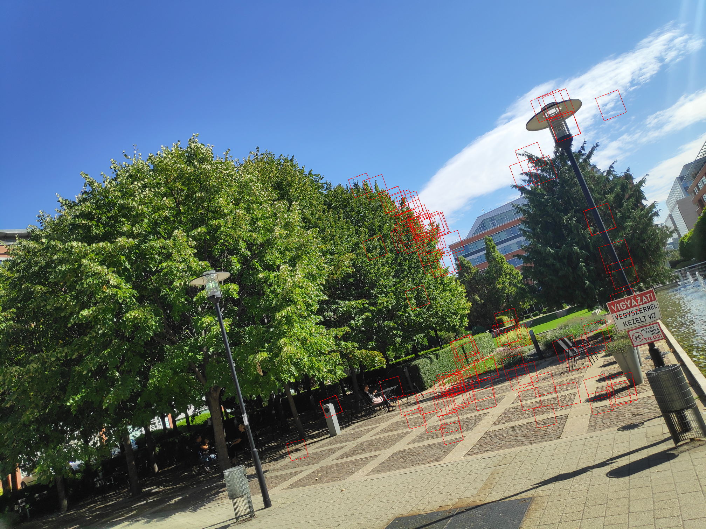

# AffineExtractor

This repository provides Python tools to extract and refine local affine transformations between image pairs based on feature matching.

Unlike standard matching pipelines that only output $(x, y)$ point correspondences, this toolbox leverages the scale and orientation properties of local descriptors (like OpenCV's SIFT) to compute the **local affine frame** for each individual match.


![Visualization of affine transformations using the SIFT meth]
<p align="center">
   
</p>
## Features

* **OpenCV SIFT Affine Matcher (`OpenCVAffineMatcher.py`)**: Computes initial local affine transformations directly from OpenCV's `cv2.SIFT` keypoint properties (`size` and `angle`) after matching.
* **Affine Refinement Tools**: The extracted initial affine frames can be further optimized using the provided refinement scripts:
  * `LucasKanadeAffineRefinement.py`: Gradient-based refinement.
  * `BruteForceAffineRefinement.py`: Search-based refinement.
* **Affine Helper (`AffineHelper.py`)**: Utility functions for manipulating and visualizing affine matrices.

---

## Data Representation & Formats

### 1. Affine Transformations
The local affine frames are mathematically represented as $2 \times 3$ matrices that map a local patch from the first image to the second image:
```math
A = \begin{bmatrix} a_{11} & a_{12} & t_x \\ a_{21} & a_{22} & t_y \end{bmatrix}
```
Within the Python pipeline, these are efficiently processed as `numpy.ndarray` objects with the shape `(N, 2, 3)`, where `N` is the number of valid feature correspondences.

### 2. Input Images
The matching and refinement algorithms process standard 8-bit image formats (`.jpg`, `.png`, `.bmp`, etc.) natively supported by OpenCV. For feature extraction and gradient-based refinement, images are typically loaded in grayscale mode.

### 3. File Export Format
If you wish to save the extracted correspondences and affine frames for external processing (e.g., for C++ pipelines), the recommended standard text/CSV format stores one match per row:

```text
a11 a21 a12 a22 tx ty x1 y1 x2 y2
```

### 4. Example Scripts
You find example scripts to show the operation of the published algorithms. All scripts are in the folder named 'scripts'. Go into this directory, and run the scripts in this order:
* runOpencvMatcher.sh
* runBruteMatcher.sh
* runLucasKanadeMatcher.sh

The resulting local affine transformations are in the folder data/infopark. The files are named as AffsSIFT.txt, AffsBrute.txt, AffsLK.txt.


Finally, you can visualize the results by calling
* runVisualize.sh

The script creates the following files: visLK1.png and visLK2.png. The affine patches are visualized by squares in the first image, parallelograms in the second image.


## Setup & Dependencies

The code is written in Python and relies on standard computer vision libraries.

```bash
pip install numpy opencv-python matplotlib scipy
```

## Contact

**Levente Hajder**
* Email: [hajder@inf.elte.hu](mailto:hajder@inf.elte.hu)
* Website: [http://cv.inf.elte.hu](http://cv.inf.elte.hu)
